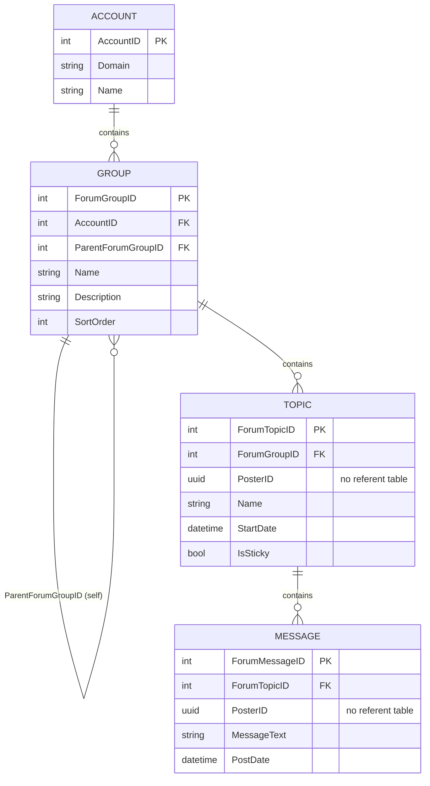
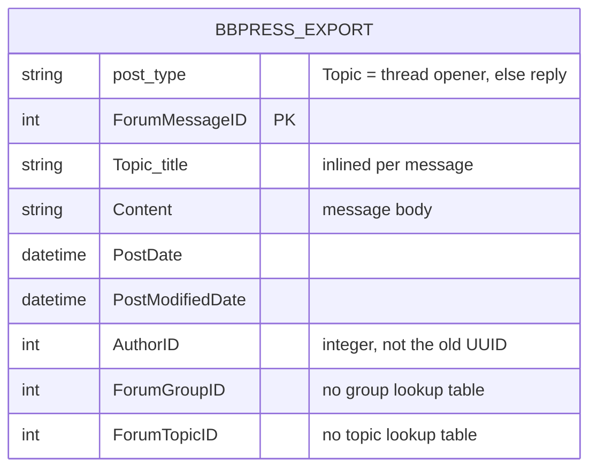

# Raw Data Schema — the two exports

What the platform actually delivered, before any processing. This documents the
**raw inputs**; the filtering and derived columns applied on top of them are in
[`DATASHEET.md`](DATASHEET.md) §4 and `statistical_decisions.md` §3–§5.

> **The two exports do not share a shape.** The **old (legacy)** export is a
> small relational database dump — four CSVs joined by keys. The **new** export
> is a flat bbPress dump — one denormalized message table per year range, with
> no lookup tables at all. Anything below stated about one export does not carry
> over to the other; §3 covers how the pipeline reconciles them.

---

## 1. Old (legacy) export — relational

Four comma-delimited CSVs in `data/`. Rendered diagram:
[`schema_forum_database_old.pdf`](schema_forum_database_old.pdf) (this section is
its source).

| File | Columns (exact header order) |
|---|---|
| `data/accounts.csv` | `AccountID, Domain, Name` |
| `data/groups.csv` | `AccountID, ForumGroupID, ParentForumGroupID, Name, Description, SortOrder` |
| `data/topics.csv` | `ForumGroupID, ForumTopicID, Name, PosterID, StartDate, IsSticky` |
| `data/messages.csv` | `ForumTopicID, ForumMessageID, PosterID, MessageText, PostDate` |

**Join path used by the pipeline.** `preprocess.build_topic_account_map`
(`preprocess.py:123-150`) merges `topics` with `groups` on `ForumGroupID` to
build a topic → `AccountID` map, and messages pick their account up from it by
`ForumTopicID` (`preprocess.py:161`, `:428-429`). A message reaches its section
only through its topic and group; there is no direct link.

Note that `AccountID` lives on `groups.csv`, so the join stops at `groups`.
`accounts.csv` is loaded because `config.CSV_FILES` lists it, but its contents
are never read — nothing in `src/` or `scripts/` touches `dfs["accounts"]`. The
`Domain` / `Name` columns are documentation of what the account IDs mean, not
inputs to the pipeline. (The step-2 docstring at `preprocess.py:6` says
"topics → groups → accounts"; the third hop does not happen in code.)

**Three consequences worth carrying into the report:**

1. **`PosterID` is a foreign key with no referent table.** No user/member entity
   was delivered, so the corpus has no demographic, clinical, or role metadata,
   and moderators had to be identified behaviourally
   (`scripts/find_moderators.py`) rather than read off a role column.
2. **`Account` is a forum *section*, not a person.** It carries only `Domain`
   and `Name`, and attaches to messages through `Group`. This is the structural
   basis for retaining both community sections (account 2 = depression, account
   3 = `naasten`) and not treating the account as an author attribute — see
   `DATASHEET.md` §4 and report §2.4.
3. **Groups are hierarchical.** `ParentForumGroupID` is a self-reference, so
   group-level exclusions (`INTRO_GROUP_KEYWORDS`) act on a tree, not a flat list.

## 2. New export — flat, denormalized

Five semicolon-delimited, BOM-prefixed CSVs in `data/new/`, split by year range
(`bbpress-export-2019-to-2020`, `2022-to-2023`, `2024-to-2024`, `2025-to-2026`,
`2026`). All share one header; the pipeline concatenates them and records
`source_file`.

**What changed relative to the old export:**

| | Old | New |
|---|---|---|
| Shape | 4 relational CSVs | 1 flat table (5 files, same header) |
| Delimiter | `,` | `;` (BOM-prefixed) |
| Author key | `PosterID`, UUID | `AuthorID`, integer |
| Message body | `MessageText` | `Content` |
| Thread opener | not marked | marked by `post_type == "Topic"` |
| Topic title | `topics.Name` | `Topic_title`, repeated on every message |
| Group / account | `groups.csv`, `accounts.csv` | `ForumGroupID` only, no lookups |
| Edit timestamp | — | `PostModifiedDate` |
| Sticky / sort / description | `IsSticky`, `SortOrder`, `Description` | dropped |

**The critical loss is `AccountID`.** The new export carries no account table and
no account column, so a new-export message cannot be assigned to a forum section.
This is why the superuser exclusion is done two different ways: account-type
filtering (`AccountID ∈ {1, 4}`) on the old data, and behavioural detection —
lexical diversity, posting-hour regularity, thread-start share — on the new data
(`integrate_datasets.py`, steps 5–6).

## 3. How the two are reconciled

`integrate_datasets.py` renames new columns to old names (`NEW_COL_MAP`), builds
an **ID bridge** matching old UUIDs to new integer IDs by posting behaviour with
a `HIGH` / `COLLISION` / `SHARED` confidence label, remaps only `HIGH` matches,
drops overlapping posts, and emits both exports on a shared column set
(`PosterID, ForumTopicID, ForumGroupID, MessageText, PostDate, PostModifiedDate,
source`). Old rows get `ForumGroupID = NA`, since the old message table has no
group column of its own.

One thing the reconciliation deliberately does *not* do: `post_type` is not used
to label thread openers. `postprocess.build_thread_structure`
(`postprocess.py:117-129`) sorts by `ForumTopicID, PostDate` and takes
`reply_index == 0` for every variant, so `is_initial_post` is derived the same
way on both exports and the new export's explicit marker is used only to pull
the topic-title review file in `harmonize_schemas`.

Two residues of the schema difference reach the analysis:

- **Not every old author is bridged.** Unmatched UUIDs keep their original value,
  so the same person may appear under two identities across exports. Per-user
  aggregation is therefore only safe *within* a variant.
- **Shape difference compounds the source/time confound.** The old export is the
  only one with section and group structure, and the new export's pre-handover
  content is back-propagated and unreliable (`DATASHEET.md` §3). Together these
  are why the analysis is capped at 2022 on the `old` variant (report §2.2).

## 4. Recommendation for anyone reusing this data

Every analysis and report script runs per variant and produces three parallel
result files (`_old`, `_new_only`, and no suffix for `combined` — see
`DATASHEET.md` §5 for the naming, including the integration step's exception).
All three are kept, so the merged view stays available.

Even so, **the advice is to treat the old and the new export as two different
datasets.** They came from different platform hosts, they have different raw
schemas, and nothing in the data links an old author to a new one — that link is
reconstructed behaviourally by the ID bridge, not read off a key. The `combined`
variant exists just in case a merged view is needed, but it is the weakest of the
three and should not carry a claim by itself.

Reliability runs **`old` > `new_only` > `combined`**: `old` is relational,
section-aware, and the most thoroughly verified; `new_only` is coherent on its
own terms but flat, section-less, and trustworthy mainly from 2022 onward;
`combined` inherits every uncertainty of both plus the bridge, the cross-export
deduplication, and the source/time confound.
